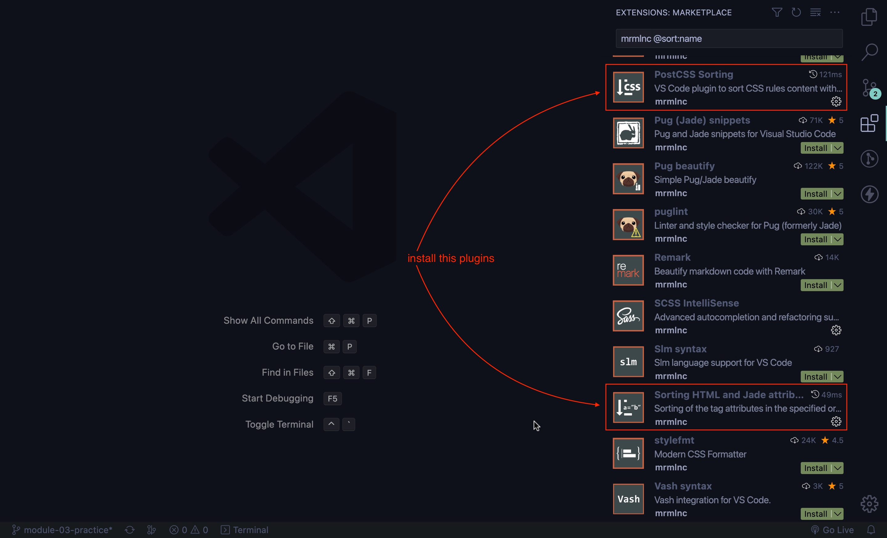
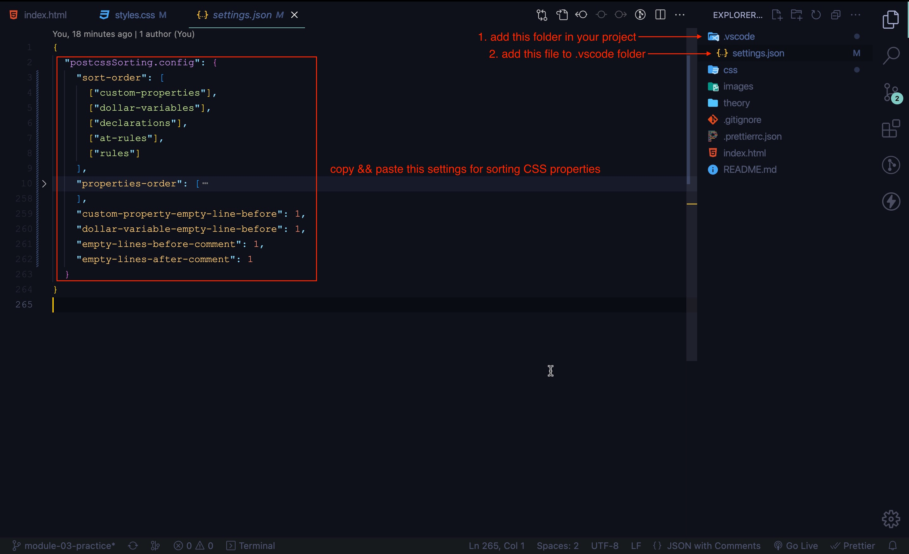
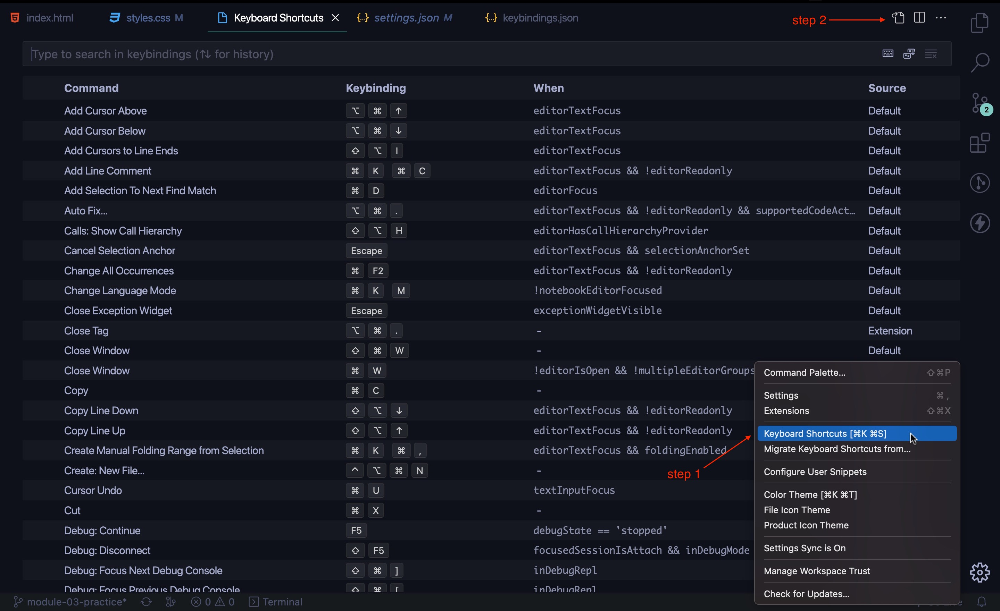
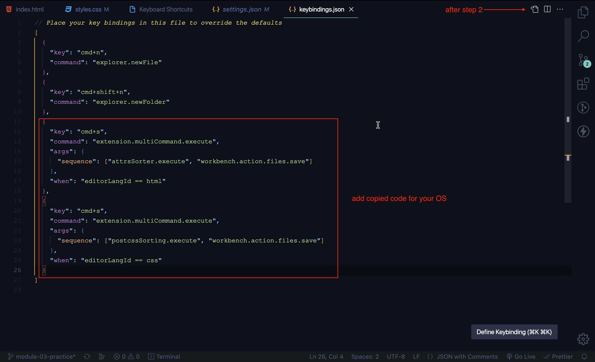

	
	

# Sorting HTML attributes and CSS properties

Setup for sorting HTML attribute and CSS properties using **mrmlnc** plugins

1. Install two plugins following next links

- [PostCSS Sorting](https://marketplace.visualstudio.com/items?itemName=mrmlnc.vscode-postcss-sorting)

- [Sorting HTML and Jade attributes](https://marketplace.visualstudio.com/items?itemName=mrmlnc.vscode-attrs-sorter)

2. Create or change file `settings.json` in `.vscode` folder

3. **Copy** code from this repository file [`settings.json`](./.vscode/settings.json) and **paste** in your `settings.json` file as see below

4. For automatic sorting HTML attributes or CSS properties by `CTRL + S` || `cmd + S` install plugin

- [multi-command](https://marketplace.visualstudio.com/items?itemName=ryuta46.multi-command)

5. **Open** Keyboard shorcuts settings **copy** code from this repository file [`keybinding.json`](./assets/keybinding.json) and **paste** in your `keybinding.json` file as see below

6. Watching this [video](https://www.loom.com/share/e21498044ffa43c2a44cbc38db4f9f70) that includes all setting for automatic sorting

---

## Resources:

- PostCSS plugin [repo](https://github.com/hudochenkov/postcss-sorting)
- PostCSS config example [repo](https://github.com/hudochenkov/stylelint-config-hudochenkov/blob/master/order.js)
- Keybinding for sort on save [article](https://www.ashvinmotye.com/blog/automatic-css-sorting/)
