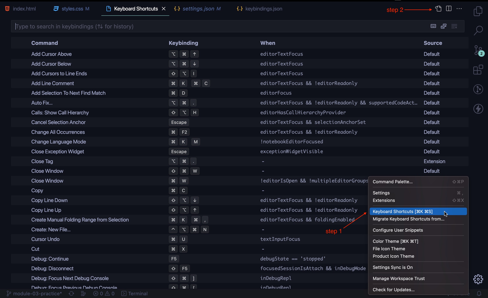

	
	

# Сортування атрибутів HTML та властивостей CSS

Покрокова інструкція по налаштуванню сортування атрибутів HTML та властивостей CSS, використовуючи плагіни від **mrmlnc**

1. Встанови два плагіни за посиланнями, вказаними нижче

- [PostCSS Sorting](https://marketplace.visualstudio.com/items?itemName=mrmlnc.vscode-postcss-sorting)

- [Sorting HTML and Jade attributes](https://marketplace.visualstudio.com/items?itemName=mrmlnc.vscode-attrs-sorter)

2. Створи або зміни файл з назвою `settings.json`, який знаходиться у папці з назвою `.vscode`

3. **Скопіюй** коди з файлу [`settings.json`](./.vscode/settings.json) цього репозиторія та **встав** у свій файл `settings.json` як показано нижче

4. Для авфтомачиної роботи сортування атрибутів HTML та властивостей CSS за допомогою комбінацій клавіш `CTRL + S` || `cmd + S` встанови наступний плагін

- [multi-command](https://marketplace.visualstudio.com/items?itemName=ryuta46.multi-command)

5. **Відкрий** налаштування Keyboard shorcuts **скопіюй** код з файлу [`keybinding.json`](./assets/keybinding.json) цього репозиторію та **встав** у свій файл `keybinding.json` як показано нижче

6. Watching this [video]() that includes all setting for automatic sorting

---

## Використані ресурси:

- PostCSS plugin [посилання на репозиторій](https://github.com/hudochenkov/postcss-sorting)
- PostCSS config example [посилання на репозиторій](https://github.com/hudochenkov/stylelint-config-hudochenkov/blob/master/order.js)
- Keybinding for sort on save [посилання на статтю](https://www.ashvinmotye.com/blog/automatic-css-sorting/)
